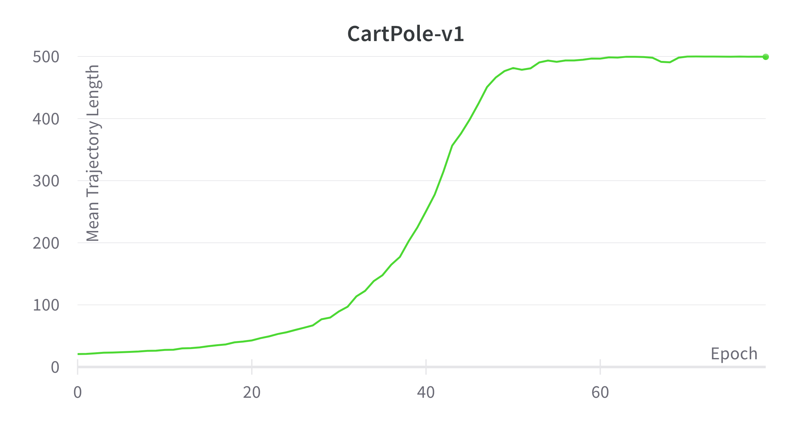
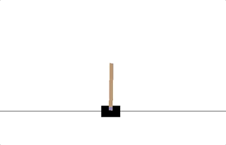

# VPG

This repository is for implementing VPG, Vanilla Policy Gradient. I referred to [CS285 class](https://rail.eecs.berkeley.edu/deeprlcourse/) of UC Berkeley, [lecture 5](https://rail.eecs.berkeley.edu/deeprlcourse/static/slides/lec-5.pdf), especially the _REINFORCE_ algorithm with utilizing _reward to go_.

_Caution_ : This code is only works on cases when action space is discrete. The test is done on the [CartPole-v1](https://gym.openai.com/envs/CartPole-v1/) environment.

## Algorithm


### Pseudo code

```bash
for EPOCH
  for num_samples
    trajectories = []
    state = env.reset()
    done = False
    while not done
      action = policy(state)
      next_state, reward, done = env.step(action)
    reward_to_go = sum(reward after current timepoint)
    trajectores.push([state, action, reward_to_go])
  log_pi_tensor = log(policy(action_tensor | state_tensor))
  loss = sum(log_pi_tensor * reward_to_go_tensor) / num_samples
  loss.backward()
  optimizer.step()
```

## Usage
### Requirements
- gym==0.21.0
- torch==1.8.1+cu101

```bash
pip install torch==1.8.1+cu101 -f https://download.pytorch.org/whl/torch_stable.html

```
- wandb==0.12.10
### Command
```bash
usage: main.py [-h] [--env_name ENV_NAME] [--num_traj N] [--lr G] 
               [--epoch N] [--hidden_dim N] [--seed N] [--cuda]
               [--wandb] [--wandb_id WANDB_ID] [--wandb_project WANDB_PROJECT]
```

### Optional arguments

- `--env_name` : Environment name (default: CartPole-v1)
    - valid options are `CartPole-v1`, `Acrobot-v1`, `MountainCar-v0`
- `--cuda` : Whether to use CUDA (default: False)
- `--wandb`  : Whether use Weight and Bias for logging(default: False)
    - `--wandb_id` : ID for wandb account(default: None)
    - `--wandb_project` : project name of wandb account(default: None)

### Example

```bash
CUDA_VISIBLE_DEVICES=1 python main.py --cuda --env_name Acrobot-v1 epoch 200
```

## Results

### Plot of change mean reward

The reward of the `CartPole-v1` environment is the length of the trajecory.

</img>

### Video of learned agent
</img>

