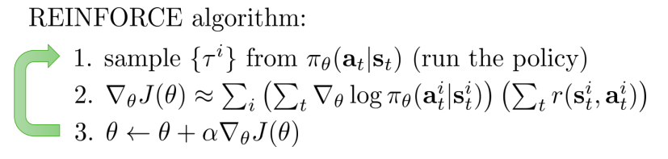

# VPG

This repository is for implementing VPG, Vanilla Policy Gradient. I referred to [CS285 class](https://rail.eecs.berkeley.edu/deeprlcourse/) of UC Berkeley, [lecture 5](https://rail.eecs.berkeley.edu/deeprlcourse/static/slides/lec-5.pdf), especially the _REINFORCE_ algorithm with utilizing _reward to go_.

## Algorithm



### pseudo code

```bash
for EPOCH
	for num_samples
    trajectories = []
    state = env.reset()
    done = False
    while not done
      action = policy(state)
      next_state, reward, done = env.step(action)
  	calculate reward_to_go
  	trajectores.push([state, action, reward_to_go])
  loss = sum(log_pi_tensor * reward_to_go_tensor) / num_samples
  loss.backward()
  optimizer.step()
```

## Usage

```bash
usage: main.py [-h] [--env_name ENV_NAME] [--num_traj N] [--lr G] 
							[--epoch N] [--seed N] [--cuda]
							[--wandb] [--wandb_id WANDB_ID] [--wandb_project WANDB_PROJECT]
```

### optional arguments

- `--env_name` : Environment name (default: CartPole-v1)
- `--cuda` : Whether to use CUDA (default: False)
- `--wandb`  : Whether use Weight and Bias for logging(default: False)
    - `--wandb_id` : ID for wandb account(default: None)
    - `--wandb_project` : project name of wandb account(default: None)

### Example

```bash
CUDA_VISIBLE_DEVICES=1 python main.py --cuda
```

## Results

### plot

### video

